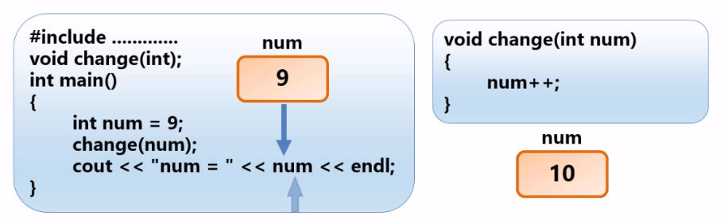

<!-- TOC depthFrom:1 depthTo:6 withLinks:1 updateOnSave:1 orderedList:0 -->

- [函数](#函数)
	- [函数基本知识回顾](#函数基本知识回顾)
		- [函数分类](#函数分类)
		- [函数的三要素](#函数的三要素)
		- [书写自定义函数](#书写自定义函数)
	- [按值传递的机制](#按值传递的机制)
		- [按值传递](#按值传递)
	- [使用数组做函数参数](#使用数组做函数参数)
	- [函数指针的用法](#函数指针的用法)

<!-- /TOC -->
# 函数
## 函数基本知识回顾
### 函数分类
+ 内置函数（STL和Boost C++）
+ 自定义函数
### 函数的三要素
+ 返回值类型
+ 函数名
+ 参数列表
### 书写自定义函数

```c++
  #include "stdafx.h"
  #include <iostream>

  using namespace std;

  //计算两个数字之和
  int sum(int, int); //函数原型


  int main()
  {
  	//调用函数
  	int result = sum(5, 6);
  	cout << "结果为：" << result << endl;
  	cin.get();
      return 0;
  }

  int sum(int num1, int num2)
  {
  	//1、计算两个数字之和
  	int result = num1 + num2;
  	//2、返回计算结果
  	return result;
  }
  ```
**注意**

  + 函数原型与函数定义的头部类似，最后以分号结尾
  + 函数原型中的参数名可以省略，只写参数类型
  + C++中返回值类型不能是数组，但可以是其他任何类型（可以将数组作为结构或对象组成部分返回）

**例子**

```c++
  #include "stdafx.h"
  #include <iostream>
  #include <cmath>
  using namespace std;

  /*
  	三种形状的体积计算公式如下：
  	长方体：长×宽×高
  	圆柱体：圆周率×半径的平方×高
  	圆锥体：1/3 × 底面积 × 高
  */
  //1、定义三个函数，分别用来计算三种形状的体积
  //2、在main函数中用户可以选择计算某个形状的体积

  void calcCuboid();	//计算长方体的体积
  void calcCylinder();	//计算圆柱体的体积
  void calcCone();	//计算圆锥体的体积

  int main()
  {
  	int choice = -1;
  	while (choice) {
  		cout << "1、长方体" << endl;
  		cout << "2、圆柱体" << endl;
  		cout << "0、退出" << endl;
  		cin >> choice;
  		switch (choice)
  		{
  		case 1:
  			calcCuboid();
  			break;
  		case 2:
  			calcCylinder();
  			break;
  		default:
  			break;
  		}
  	}
  	cout << "感谢使用本软件！！！" << endl;
  	cin.get();
  	cin.get();
  	return 0;
  }

  void calcCuboid()
  {
  	//输入长宽高
  	double len, width, height;
  	cout << "请输入长宽高：";
  	cin >> len >> width >> height;
  	//计算体积
  	double v = len * width * height;
  	cout << "长方体体积为：" << v << endl;
  }

  void calcCylinder()
  {
  	double radius, height; //半径
  	cout << "请输入半径和高：";
  	cin >> radius >> height;
  	//计算面积
  	double pi = 4 * atan(1.0);
  	double v = pi * pow(radius, 2) * height;
  	cout << "圆柱体的体积为：" << v << endl;
  }
```
## 按值传递的机制
### 按值传递
+ 给函数传递变元（参数）时，变元（参数）值不会直接传递给函数，而是先制作变元（参数）值得副本，存储在栈上，再使这个副本可用于函数，而不是使用初始值。



**注意**
+ 如果传递的是引用，那么结果是不一样的，打印结果会改变为11

## 使用数组做函数参数
+ 参考demo.h 和 arraydemo.h 和main函数

## 函数指针的用法
+ 函数也有地址
    - 函数的地址是存储其机器语言代码的内存开始
    - 好处：可以在不同的时间使用不同的函数
+ 函数指针的声明

```c++
//函数原型
double sum(double, double);
//函数指针的声明：
double(*ptrSum)(double, double)
```

**注意**
+ 该语句声明了一个指针ptrSum，指向一个函数
+ double *ptrSum（double， double）不是指针函数，而是声明了一个函数ptrSum，返回double *类型

+ 例子1

```c++
头文件中：（funcptr.h）
  #include <iostream>

  using namespace std;

  int power(int, int);

  int power(int num1, int num2)
  {
  	int result = 1;
  	for (int i = 0; i < num2; i++)
  	{
  		result *= num1;
  	}
  	return result;
  }

  main函数中：
  #include "stdafx.h"
  #include <iostream>
  #include "funcptr.h"
  using namespace std;

  int main()
  {
  	//int power(int, int);
  	//声明函数指针
  	int (*ptrPower)(int, int);
  	//让声明的函数指针指向函数，以便调用
  	ptrPower = power;

  	cout << (*ptrPower)(3, 4) << endl;
    cin.get();
    cin.get();
    return 0 ;
  }
  ```

+ 例子2

```
  头文件（myCalc.h）:
  #pragma once
  # include<iostream>
  using namespace std;

  //自定义计算器，使用函数指针
  /** 加法 */
  double addition(double, double);
  /** 减法 */
  double subtraction(double, double);
  /** 乘法 */
  double multiplication(double, double);
  /** 除法 */
  double division(double, double);
  /** 打印计算结果 */
  void print_result(double(*)(double, double), double, double);


  void print_result(double(*ptrCalc)(double, double), double num1, double num2)
  {
  	//调用函数,打印结果
  	double result = ptrCalc(num1, num2);
  	cout << "运算结果为：" << result << endl;
  }

  double addition(double num1, double num2) {

  	return num1 + num2;
  }

  double subtraction(double num1, double num2) {
  	return num1 - num2;
  }
  double multiplication(double num1, double num2) {
  	return num1 * num2;
  }
  double division(double num1, double num2) {
  	if (num2 == 0)
  	{
  		cout << "除数不能为零！！！" << endl;
  		return 0;
  	}
  	return num1 / num2;
  }

  main函数：
  #include "stdafx.h"
  #include <iostream>
  #include <cmath>
  #include "demo.h"
  #include "arraydemo.h"
  #include "funcptr.h"
  #include "myCalc.h"
  #include <string>
  using namespace std;


  int main()
  {
  	//定义函数指针
  	//typedef double(*ptrCalc)(double, double);
  	//ptrCalc ptrCalc1;
  	double(*ptrCalc)(double, double);
  	ptrCalc = addition;
  	//auto ptrCalc = addition;
  	double num1, num2;
  	char op;
  	cout << "请输入两个操作数：";
  	cin >> num1 >> num2;
  	cout << "请输入运算符：";
  	cin >> op;

  	switch (op)
  	{case '+':
  		//调用加法函数
  		ptrCalc = addition;
  		break;
  	case '-':
  		//调用函数减法
  		ptrCalc = subtraction;
  		break;
  	case '*':
  		//调用函数乘法
  		ptrCalc = multiplication;
  		break;
  	case '/':
  		//调用函数除法
  		ptrCalc = division;
  		break;
  	default:
  		break;
  	}
  	//调用
  	print_result(ptrCalc, num1, num2);
    cin.get();
    cin.get();
    return 0;
  }
```

**注意**
+ 1、C++11中可以使用auto ptrFunc = addition；自动推断类型（自动推断类型需要确保变量的类型与初值类型一致）
+ 2、可以使用typedef简化声明：
  - typedef double(*ptrCalc)(double, double);
  - ptrCalc ptrCalc1;
