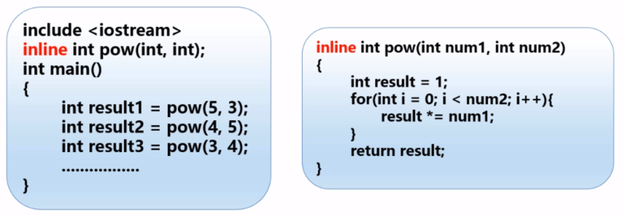
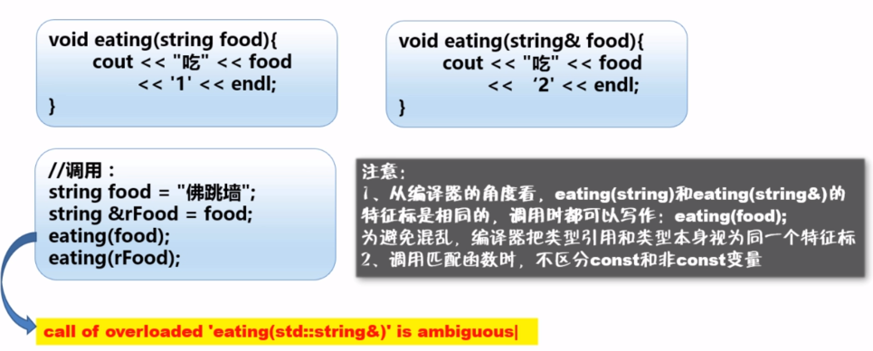

<!-- TOC depthFrom:1 depthTo:6 withLinks:1 updateOnSave:1 orderedList:0 -->

- [内联函数](#内联函数)
	- [内联（inline）函数](#内联inline函数)
	- [使用内联特性（采取其一）](#使用内联特性采取其一)
- [参数的人引用传递](#参数的人引用传递)
	- [引用](#引用)
	- [返回引用](#返回引用)
		- [函数返回引用类型](#函数返回引用类型)
		- [引用参数小结](#引用参数小结)
- [默认参数](#默认参数)
	- [使用默认参数](#使用默认参数)
- [函数重载(overloading)](#函数重载overloading)
- [函数模板](#函数模板)

<!-- /TOC -->
# 内联函数
## 内联（inline）函数
+ 是C++为提高程序运行速度所做的一项改进
+ 与常规函数的区别不在于编写方式
  - 编译器使用函数代码替换函数调用
  -
**使用建议**
+ 如果执行函数代码的时间比处理函数调用机制的时间长，则节省的时间将只占整个过程的很小一部分
+ 如果代码执行时间很短，内联调用就可以节省大部分时间

## 使用内联特性（采取其一）
+ 在函数声明前加关键字inline
+ 在函数定义前加关键字inline



```c++
  #include "stdafx.h"
  #include <iostream>

  #define N 5					//以后使用N的所有场合，都会被自动替换为5
  //#define S(num) num * num	//宏定义了一个S(num)函数
  //以后在所有使用S(num)的地方，就自动被替换成num * num
  using namespace std;
  //内联：替换
  inline int S(int);
  int main()
  {
  	// 5 + 10 * 5 + 10 = 65
  	int result1 = S(5 + 10);
  	cout << result1 << endl;
  	cin.get();
  	cin.get();
      return 0;
  }

  int S(int num)
  {
  	return num * num;
  }

```
# 参数的人引用传递
## 引用
+ 为对象起了另外一个名字（引用即别名）

```c++
int int_value = 1024;
//refValue指向int_value,是
int& refValue = int_value;
//错误：引用必须被初始化
int& refValue2;
```

**注意**
+ 引用并非对象，只是为一个已经存在的对象起的别名
+ 引用更接近const指针，一旦与某个变量关联起来，就将一直效忠于它
+ 将引用变量用作参数时，函数将使用原始数据，而非副本
+ 当数据所占内存比较大时，建议使用引用参数

```c++
  #include "stdafx.h"
  #include <iostream>

  using namespace std;

  void Swap1(int, int);
  void Swap2(int*, int*);
  void Swap3(int&, int&);
  void show(const int&, const int&);

  int main()
  {
  	int num1 = 5, num2 = 10;
  	Swap1(num1, num2);
  	cout << "执行Swap1后的结果：" << num1 << "\t" << num2 << endl;
  	show(num1, num2);
  	Swap2(&num1, &num2);
  	cout << "执行Swap2后的结果：" << num1 << "\t" << num2 << endl;
  	Swap3(num1, num2);
  	cout << "执行Swap2后的结果：" << num1 << "\t" << num2 << endl;
  	cin.get();
  	cin.get();
      return 0;
  }

  void Swap1(int num1, int num2) {
  	int temp;
  	temp = num1;
  	num1 = num2;
  	num2 = temp;
  }

  void Swap2(int* p1, int* p2) {
  	int temp;
  	temp = *p1;
  	*p1 = *p2;
  	*p2 = temp;
  }

  void Swap3(int& ref1, int& ref2) {
  	//使用引用
  	//1、可以更加简便的书写代码
  	//2、可以直接传递某个对象，而不是只是把对象复制一份
  	int temp;
  	temp = ref1;
  	ref1 = ref2;
  	ref2 = temp;
  }

  void show(const int& num1, const int& num2)
  {
  	//希望显示逻辑中，只能实现传入参数的显示功能
  	//而禁止显示函数修改num1和num2的值（禁止函数内部修改引用参数值）
  	//解决方案：在参数中使用const
  	cout << "执行Swap后：" << num1 << "\t" << num2 << endl;
  }
```

## 返回引用
### 函数返回引用类型
+ 不要返回局部变量的引用

```c++

  #include "stdafx.h"
  #include <iostream>

  int& sum()	//返回引用类型的函数
  {
  	int num = 10;
  	//注意：rNum是在sum()函数中定义的，故叫局部变量
  	//rNum的生存期只在sum()函数中！
  	int& rNum = num;

  	//函数中的局部变量会被内存回收
  	//所谓内存回收，并不是把内存的设置清零，
  	//而不是指内存中你的程序申请的这块内存已经不是你的了！
  	//不要返回局部变量的引用

  	return rNum;	//返回一个局部类型的引用类型变量
  }
  void test()
  {
  	int x = 1;
  	int y = 2;
  }
  int main()
  {
  	int& result = sum();
  	test();
  	cout << "result = " << result << endl;
  	cin.get();
  	cin.get();
      return 0;
}
```
+ 函数可以不返回值，默认返回传入的引用对象本身

```c++
int& sum(int& num1, int& num2)
{
	num1++;
	num2++;
}
int main()
{

	int num1 = 10, num2 = 15;
	int& result = sum(num1, num2);
	cout << "result = " << result << endl;
  cin.get();
  cin.get();
  return 0;
```
+ 函数返回引用类型

```c++
nt & sum(int& num)
{
	num++;
	return num;
}

int main()
{
	int num = 10;
	int& result = sum(num);
	sum(num) = 55;
	cout << "result = " << result << endl;
  cin.get();
  cin.get();
  return 0;
}
```

**关于左值右值**
**建议解决方案**
+ 将返回类型修改为const int& const int& sum(int& num){...}
+ const类型为不可修改的左值，sum(num)  = 55将不合法
+ 省略const会使函数的含义更加模糊，建议避免在设计函数中存在模糊的情况，因为模糊会增加犯错误的机会，应尽量避免犯错。

###引用参数小结
+ 使用引用参数的一些指导原则
  - 能够修改调用函数中的数据对象
  - 数据对象较大时传递引用可以提高程序的运行效率
    - 函数中不需要修改传递的参数
      - 如果数据对象很小，建议按值传递
      - 传递数组只能使用指针，并使用const关键字
      - 较大的对象则使用const指针或引用，以提高程序的效率
    - 函数中需要修改传递的参数
      - 数据对象是基本类型或结构时，可以使用指针或者引用（基本类型建议使用指针）
      - 数据对象是数组时只能使用指针
      - 数据对象时类对象时，要求使用引用


+ 随堂练习

```c++
  #include "stdafx.h"
  #include <iostream>
  #include <string>
  using namespace std;

  //模拟实现游戏中私聊的函数
  /**
  * 跟某人聊天 —— 负责字符串拼接（聊天格式）
  * @param toName 聊天对象的名称
  * @param content 聊天的内容
  * @return 按某规定的格式拼接聊天信息后的字符串
  */
  string chatTo(const string& toName, const string& content);
  string chatFrom(const string& fromName, const string& content);

  int main()
  {
  	string toName, content, fromName;
  	cout << "请输入自己的姓名：";
  	getline(cin, fromName);
  	cout << "请输入对方的名称：";
  	getline(cin, toName);
  	cout << "请输入发送给对方的聊天信息：";
  	getline(cin, content);
  	string chatMsg = chatTo(toName, content);
  	cout << endl << chatMsg << endl;
  	string chatFromMsg = chatFrom(fromName, content);
  	cout << endl << chatFromMsg << endl;

  	cin.get();
  	cin.get();
      return 0;
  }

  /**
  * 跟某人聊天 —— 负责字符串拼接（聊天格式）
  * @param toName 聊天对象的名称
  * @param content 聊天的内容
  * @return 按某规定的格式拼接聊天信息后的字符串
  */
  string chatTo(const string& toName, const string& content)
  {
  	string msg = "﹡对[" + toName + "]说﹡" + content;
  	return msg;
  }
  string chatFrom(const string& fromName, const string& content)
  {
  	string msg = fromName+ "[对﹡" + "﹡说]" + content;
  	return msg;
  }
```  
# 默认参数
## 使用默认参数

```c++
void sample(int  = 10);
int main()
{
  sample();
  sample(123);
}
void sample(int num)
{
  cout << num << endl;
}
```

**注意**
+ 默认值可以在函数原型或定义中给出，不能在这两个位置同时出现
+ 对于带参数列表的函数，必须从右向左添加默认值
  - void test1(int a, int b = 5, int c = 10);
  - void test2(int a, int b = 5, int c);
  - void test3(int a = 11, int b = 5, int c = 10);

# 函数重载(overloading)
+ 指可以有多个同名的函数
+ 函数名相同，参数列表不同（特征标不同）
  - 重载——编译器在编译时，根据参数列表对函数进行重命名
  - void Swap(int a, int b);
  - Swap_int_int
  - void Swap(float a, float b);
  - Swap_float_float



+ 随堂练习

```c++
  #include "stdafx.h"
  #include <iostream>
  #include <string>
  using namespace std;

  //使用重载实现数组的排序
  //函数名相同，参数列表不同
  void Sort(int[], int len);
  void Sort(float[], int len);
  void Sort(double[], int len);
  void Show(int[], int len);
  void Show(float[], int len);
  void Show(double[], int len);
  int main()
  {
  	int iNums[]{ 56, 54, 12, 89, 43 };
  	float fNums[]{ 78.0f, 5.7f, 42.8f, 99.1f };                
  	double dNums[]{ 78.9, 23.6, 77.8, 98.5, 33.3 };

  	cout << "排序前：";
  	Show(iNums, sizeof(iNums) / sizeof(iNums[0]));
  	Sort(iNums, sizeof(iNums) / sizeof(iNums[0]));
  	cout << "排序后：";
  	Show(iNums, sizeof(iNums) / sizeof(iNums[0]));
  	Show(iNums, sizeof(iNums) / sizeof(iNums[0]));

  	cin.get();
  	cin.get();
      return 0;
  }

  void Sort(int nums[], int len) {
  	int temp;
  	cout << "sizeof(nums) = " << sizeof(nums) << endl;
  	for (int i = 0; i < len; i++)
  	{
  		for (int j = 0; j < len - i - 1;j++)
  		{
  			temp = nums[j];
  			nums[j] = nums[j + 1];
  			nums[j + 1] = temp;
  		}
  	}
  }

  void Sort(float nums[], int len) {
  	int temp;
  	for (int i = 0; i < len; i++)
  	{
  		for (int j = 0; j < len - i - 1;j++)
  		{
  			temp = nums[j];
  			nums[j] = nums[j + 1];
  			nums[j + 1] = temp;
  		}
  	}
  }

  void Sort(double nums[], int len) {
  	int temp;
  	for (int i = 0; i < len; i++)
  	{
  		for (int j = 0; j < len - i - 1;j++)
  		{
  			temp = nums[j];
  			nums[j] = nums[j + 1];
  			nums[j + 1] = temp;
  		}
  	}
  }

  void Show(int nums[], int len)
  {
  	for (int i = 0; i < len; i++)
  	{
  		cout << nums[i] << endl;
  	}
  }
```
# 函数模板
+ 所谓函数模板，实际上就是建立一个通用函数
  - 函数定义时不能指定具体的数据类型（使用虚拟类型代替）
  - 函数被调用时编译器根据实参反推数据类型-类型的参数化

```c++
//模板与函数声明/定义i永远时不可分割的整体！
template <typename 类型参数1, typename 类型参数2，...>
返回值类型 函数名（形参列表）{
  //函数体中可以使用类型参数

例：
//函数声明
template<typename T> void Swap(T&, T&);

/**
*使用模板技术实现变量交换值
*/
template<typename T> //模板头
void Swap(T &a, T &b)
{
  T temp = a;
  a = b;
  b = temp;
}
```

+ 完整例子

```c++
//书写函数模板
template<typename T> void Sort(T tArray[], int len);
template<typename T> void Show(T tArray[], int len);
int main()
{


	int iNums[]{ 56, 54, 12, 89, 43 };
	float fNums[]{ 78.0f, 5.7f, 42.8f, 99.1f };                
	double dNums[]{ 78.9, 23.6, 77.8, 98.5, 33.3 };
	string sNums[]{ "关羽","张飞","黄忠" };


	cout << "排序前：";
	Show(iNums, sizeof(iNums) / sizeof(iNums[0]));
	Sort(iNums, sizeof(iNums) / sizeof(iNums[0]));
	cout << "排序后：";
	Show(iNums, sizeof(iNums) / sizeof(iNums[0]));


	cout << "排序前：";
	Show(fNums, sizeof(fNums) / sizeof(fNums[0]));
	Sort(fNums, sizeof(fNums) / sizeof(fNums[0]));
	cout << "排序后：";
	Show(fNums, sizeof(fNums) / sizeof(fNums[0]));


	cout << "排序前：";
	Show(dNums, sizeof(dNums) / sizeof(dNums[0]));
	Sort(dNums, sizeof(dNums) / sizeof(dNums[0]));
	cout << "排序后：";
	Show(dNums, sizeof(dNums) / sizeof(dNums[0]));

	cout << endl;
	Show(sNums, sizeof(sNums) / sizeof(sNums[0]));
	cin.get();
	cin.get();
    return 0;
}
template<typename T>
void Sort(T tArray[], int len)
{
	int temp;
	cout << "sizeof(tArray) = " << sizeof(tArray) << endl;
	for (int i = 0; i < len; i++)
	{
		for (int j = 0; j < len - i - 1;j++)
		{
			temp = tArray[j];
			tArray[j] = tArray[j + 1];
			tArray[j + 1] = temp;
		}
	}
}

template<typename T>
void Show(T tArray[], int len)
{
	for (int i = 0; i < len; i++)
	{
		cout << tArray[i] << "\t";
	}
	cout << endl;
}
```
