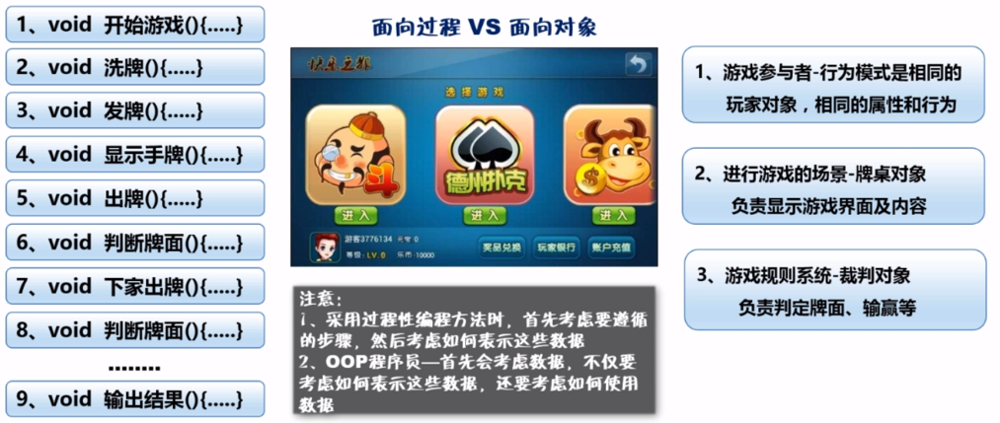
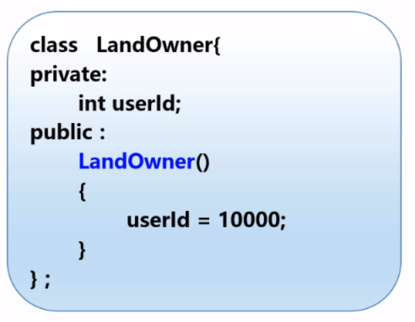

# 面向对象编程
## 何为面向对象
+ 所谓面向对象就是基于对象概念，以对象为中心，以类和继承为构造机制，来认识、理解、刻画客观世界和设计、构建相应的软件系统（模拟现实）
  - 对象是数据和容许的操作组成的封装体，与客观实体有直接对应关系
  - 面向对象不是某一种语言的特性，而是一种编程思想

## 面向对象VS面向对象



**注意**
+ 采用过程性编程方法时，首先考虑要遵循的步骤，然后考虑如何表示这些数据
+ OOP程序员——首先会考虑数据，不仅要考虑如何表示这些数据，还要考虑如何使用这些数据

# 类和对象
## 抽象
+ 从具体事物抽取出共同的本质特征

## C++中的类
+ 类是一种将抽象转换为用户定义类型的工具
+ 将数据表示和操纵数据的方法组合成一个整体
+ 类的实例称为对象
+ 类中的变量和函数称为成员
+ 示例

```c++
//地主类的声明
class LandOwner{
  public：
  LandOwner();            /** 默认构造函数*/
  ~LandOwner();           /** 默认析构函数*/
  string name;            /** 名称*/
  long score;             /** 积分*/
  int cards[20];          /** 手牌数组*/

  void TouchCard(int[]);  /** 摸牌*/
  bool PlayCard(int[]);   /** 出牌*/
  void ShowScore();       /** 查看积分*/
};
```

# 类的成员变量
## 类的声明
+ 使用class/struct关键字声明类型
  - class 类名{};  // class LandOwner{};
  - struct 类名{}; // struct Hero{};

**注意**
+ class方式声明的类型与struct声明的类型仅仅是形式上不同
+ 其唯一的区别在于使用class声明的类型默认成员是私有的（private），而struct声明的类型默认成员是公有的（public）

# 访问修饰符
## 常见访问修饰符
+ public：修饰的成员在任意地方都可以访问
+ private：修饰的成员只能够在类中或者友元函数中可以访问
+ protected：修饰的成员可以在类中函数、子函数及友元函数中访问

## 修饰成员
+ 将修饰关键字放置在类定义的大括号中，添加冒号

```c++
  class 类名{
    修饰符：
      成员列表：
  }
  例：
  class LandOwner{
    private：
      string name;
    public:
      void PlayCard();
  }
```

## 函数声明

```c++
class 类名{
  修饰符1：
  变量1类型 变量1名称;
  变量2类型 变量2名称;
}
例：
class LandOwner{
public:
  string name;
  long score;
public:
  void ShowScore();
}
```

## 函数定义

```c++
返回类型 类名::函数名(){
  //函数操作
}

void LandOwner::ShowScore(){
  cout << score << endl;
}
```

+ 例子

```c++
  + main函数
  // SixtyTest.cpp : 定义控制台应用程序的入口点。
  //

  #include "stdafx.h"
  #include <iostream>
  #include "LandOwnerv1.h"	//如果要使用类，必须包含类的头文件
  #include "LandOwnerv2.h"
  using namespace std;

  int main()
  {
  	// 数据类型 变量名
  	int num;
  	num = 0;
  	LandOwnerv1 landOwner1;	//声明了一个LandOwner类型的变量-landOwner1
  	//调用对象的成员方法
  	landOwner1.name = "LYL";
  	landOwner1.TouchCard(20);
  	LandOwnerv2 landOwner2;
  	landOwner2.name = "LYL";
  	//landOwner2.score = 100;
  	landOwner2.SetScore(-100);
  	landOwner2.Showscore();
  	cout << landOwner2.name << endl;

  	cin.get();
  	cin.get();
      return 0;
  }

  + .h文件

  #pragma once
  #include "stdafx.h"
  #include <iostream>
  #include <string>
  using namespace std;
  class LandOwnerv2
  {
  	//省略了private，默认是private
  	long score;		// 解决积分被赋值为负数错误的方法，将成员变量score进行隐藏并封装
  	int cards[20];	// 地主的手牌数组
  public:
  	string name;
  	LandOwnerv2();
  	~LandOwnerv2();
  	void Showscore();

  	//使用方法/函数实现对成员变量的封装Get/Set方法
  	void SetScore(long lScore)
  	{
  		if (lScore < 0)
  		{
  			//如果传入的积分是非法情况，那么积分默认为0
  			score = 0;
  		}
  		else {
  			//积分为正数时：才进行赋值操作——这里就通过条件判断，封装了score的赋值过程
  			score = lScore;
  		}
  	}
  };

  + .cpp文件

  #include "stdafx.h"
  #include "LandOwnerv2.h"

  LandOwnerv2::LandOwnerv2()
  {
  }
  void LandOwnerv2::Showscore()
  {
  	cout << name << "得了" << score << "分" << endl;
  }

  LandOwnerv2::~LandOwnerv2()
  {
  }
```

# 构造与析构函数
## 构造函数
+ 以类名作为函数名
+ 无返回值类型
## 作用
+ 初始化对象的数据成员
+ 类对象被创建时，编译器为对象分配内存空间并自动调用构造函数以完成成员的初始化



## 构造函数的种类
+ 无参构造
+ 一般构造（重载构造）
+ 拷贝构造

**注意**
+ 如果创建的类中未书写任何构造函数，系统会自动生成默认的无参构造函数（函数为空，什么都不做）
+ 如果书写了构造函数，系统就不会再自动生成默认构造：如果希望有一个这样的无参构造函数，需要自己显示的书写出来

## 带参构造

+ 类名::构造(类型1 参数1, 类型2 参数2,...){
  //相关代码初始化
}

```C++
Student::Student(string name, string desc)
{
  _name = name;
  _desc = desc;
}
Student* stu = new Student("撒贝宁","北大还行");
stu -> ShowInfo();
```

## 栈内存与堆内存
## 析构函数
+ 对象过期的时候自动调用的特殊成员函数
+ 析构函数一般用来完成清理工作
+ 析构函数的名称是在类名前加上~
  - 析构函数没有参数，只能有一个

**注意**
+ 析构函数用来释放对象使用的资源，并销毁对象的非static数据成员
+ 无论何时一个对象被销毁，都会自动调用其析构函数（隐式结构）

```c++
class Student{
private:
  double * scores;
public:
  Student(int len)
  {
    //使用new分配资源
    scores= new double[len];
  }
  ~Student()
  {
    delete scores;  //释放资源
  }
}
```

# this指针
+ 每个成员函数（包括构造和析构）都有一个this指针
+ this指针指向调用对象，即可以通过this关键字访问当前对象的成员
  - 访问成员变量
  - this->成员名；
  - 访问成员函数
  - this->函数名();

**注意**
+ this指针的类型为类类型*const(类名*const)，为右值
+ this指针本身不占用大小，它并不是对象的一部分，因此不会影响sizeof的结果
+ this的作用域在类成员函数的内部
+ this指针是类成员函数的第一个默认隐含参数，编译器自动维护传递，类编写者不能显示传递
+ 只有在类的非静态成员函数中才可以使用this指针，其他任何函数都不可以
