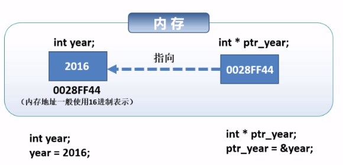
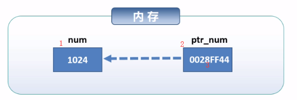
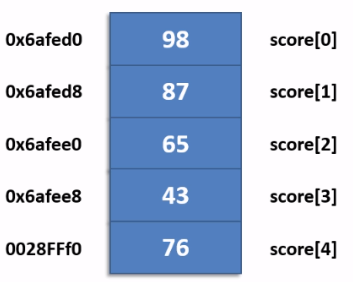

<!-- TOC depthFrom:1 depthTo:6 withLinks:1 updateOnSave:1 orderedList:0 -->

- [理解指针的基本概念](#理解指针的基本概念)
	- [指针简介](#指针简介)
- [指针变量](#指针变量)
	- [基本用法](#基本用法)
		- [数据类型 * 指针变量名](#数据类型-指针变量名)
		- [取地址符&](#取地址符)
		- [间接运算符](#间接运算符)
		- [指针的使用示例](#指针的使用示例)
		- [空指针（null pointer）](#空指针null-pointer)
		- [void *指针](#void-指针)
		- [指针小结](#指针小结)
- [理解指针和数组的关系 增加对内存和栈内存的讲解](#理解指针和数组的关系-增加对内存和栈内存的讲解)
- [使用指针操作数组](#使用指针操作数组)

<!-- /TOC -->
# 理解指针的基本概念
## 指针简介
+ 指针是一个值为内存地址的变量（或数据对象）


# 指针变量
## 基本用法
### 数据类型 * 指针变量名

```C++
  int * ptr_num;
  char * ptr_num;
  float * money_ptr;
  double * p_price;
```
+ 注意：
  - int* p的写法偏向于地址，即p就是一个地址变量，表示一个十六进制地址
  - 2、3点如下
```C++
  int *p的写法偏向于值， *p是一个整型变量，能够表示一个整型值（建议两者相结合进行理解）；
  声明中的 * 号和使用中的 * 号含义完全不同
```

### 取地址符&

```C++
int num = 1024;
int* ptr_num;
//取num变量的地址赋值给ptr_num
ptr_num = &num;
```

### 间接运算符


```C++
int num = 1024;
int ptr_num;
ptr_num = &num;
*ptr_num = 1111;
```
### 指针的使用示例
```c++
  #include "stdafx.h"
  #include <iostream>

  using namespace std;

  int main()
  {
  	double num = 1024.5;
  	//声明指针指向num变量
  	double* ptr_num = &num;

  	cout << "ptr_num的值：" << ptr_num << endl;
  	cout << "ptr_num指向空间的值" << *ptr_num << endl;
  	cin.get();
    return 0;
  }
  result：
  ptr_num的值：0093F798
  ptr_num指向空间的值1024.5
```

```C++
  #include "stdafx.h"
  #include <iostream>

  using namespace std;

  int main()
  {
  	char ch = 'a';
  	char* ptr_ch = &ch; //把char型指针当成字符串了，所以如果打印的时候不强制转换，那么就不会打印出正确地址

  	cout << (void *)ptr_ch <<'\t' << *ptr_ch << endl;
  	cin.get();
    return 0;
  }
  result：
  1、a烫烫&l潼x    a   ——没有加（void *）强制转换

  2、00FEF8E7        a
```

### 空指针（null pointer）
+ 空指针不指向任何对象，在试图使用一个指针之前可以首先检查指针是否为空
+ 用法

```C++
int *ptr1 = nullptr; //等价于int* ptr1 = 0；
int *ptr2 = 0; //直接将ptr2初始化为字面常量0

//需要包含cstdlib
int *ptr3 = NULL; //等价于int *ptr2 = 0；
```

**注意**
+ 强烈建议初始化所有的指针，并在可能的情况下，尽量等定义了对象之后再定义指向它的指针。

### void *指针
+ 一种特殊的指针类型， 可以存放任意对象的地址

```C++
using namespace std;

int main()
{
	double objNum = 3.14;
	double *ptr_obj = &objNum;

	//cout << boolalpha; //控制输出Ture or False
	void *vptr_obj = &objNum;	//可以指向任意类型
	cout << (ptr_obj == vptr_obj) << endl;
	cin.get();
  return 0;
}
result:
1
```

**注意**
+ void*指针存放一个内存地址，地址指向的内容是什么类型不确定
+ void*类型指针一般用来：和别的指针比较、作为函数的输入和输出；赋值给另一个void*指针

### 指针小结
+ 指针同样是一个变量，只不过该变量中存储的是另一个对象的内存地址
+ 如果一个变量存储另一个对象的地址，则称该变量指向这个对象
+ 指针变量可以赋值，指针的指向在程序执行中可以改变
  - 指针p在执行中某时刻指向变量x，在另一时刻也可以指向变量y

**注意**
+ 指针变量的命名规则和其他变量的命名规则一样
+ 指针不能与现有的变量同名
+ 指针可任何基本数据类型、数组和其他所有高级数据结构的地址
+ 若指针已声明为指向某种类型数据的地址，则它不能用于存储其他类型数据的地址
+ 应为指针指定一个地址后，才能在语句中使用指针

## 引用(reference)
+ 为对象起了另外一个名字（引用即对象）
+ 指向常量的引用是非法的（const double& ref  = 100 ——正确）

```c++
int int_value = 1024;
//refValue指向int_value,是int_value的另一个名字
int& refValue = int_value;

// 错误：引用必须被初始化
int& refValue2;
```
**注意**
+ 引用并非对象，只是为一个已经存在的对象起别名
+ 引用只能绑定在对象上，不能与字面值或某个表达式的计算结果绑定在一起（interesting &ref_value= 10； //错误）
+ 引用必须初始化，所以使用引用之前不需要测试其有效性，因此使用引用可能会比使用指针效率高

## 指针和引用
+ 两者之间的关系
	- 引用对指针进行了简单的封装，底层仍然是指针
	- 获取引用地址时，编译器会进行内部转换
+ 例如

```c++
int num = 108;
int& rel_num = num;
rel_num = 118;
cout << &num << "\t" << &rel_num << endl;

//等同于如下
int num = 108;
int* rel_num = &num;
*rel_num = 118;
cout << &num << "\t" << rel_num << endl;
```
# 理解指针和数组的关系 增加对内存和栈内存的讲解
## 数组
+ 存在一块连续的内存空间中
+ 数组名就是这块连续内存空间的首地址

```c++
int main()
{
	double score[]{ 11, 22, 33, 44, 55 };
	double * ptr_score = score;

	//数组——数组名就是数组的首地址
	//指针的大小一般是4个字节
	cout << sizeof(score) << '\t' << sizeof(ptr_score) << endl;
	cout << ptr_score[2] << endl;
}
```
## 指针运算
+ 指针的算术运算
	- 指针的递增和递减(++ --)
	- 指针加上或减去某个整数值

```c++
int main()
{
	int i;
	double score[5]{ 98, 87, 65, 43, 76 };
	double * ptr_score;
	ptr_score = score;
	for (i = 0; i < 5; i++)
	{
		cout << *ptr_score++ << endl;
	}
}
```

```c++
int main()
{
	int i;
	double score[5] = { 98, 87, 65, 43, 76 };
	double * ptr_score;
	ptr_score = &score[1];
	ptr_score += 2;
	cout << *ptr_score << endl;
	ptr_score -= 3;
	cout << *ptr_score << endl;
}
```



**注意**
+ 一个类型为T的指针移动，以sizeof（T）为移动单位

## 数组与指针小结
+ int num[50]; //num是数组名，也可以理解成数组的首地址
+ num的值与&num[0]的值是相同的
+ 数组第i+1个元素可表示为：
	- 第i+1个元素的地址：&num[i+1] 或 num + i
	- 第i+1个元素值：num[i+1] 或*（num i + 1）同样尝试*++ptr_num的值
+ 为指向数组的指针赋值：
	- int * ptr_num = num； 或 int * ptr_num= &num[0];
+ 指针变量可以指向数组元素
	- int * ptr_num= &num[4]; 或 int * ptr_num = num + 4；
# 使用指针操作数组
